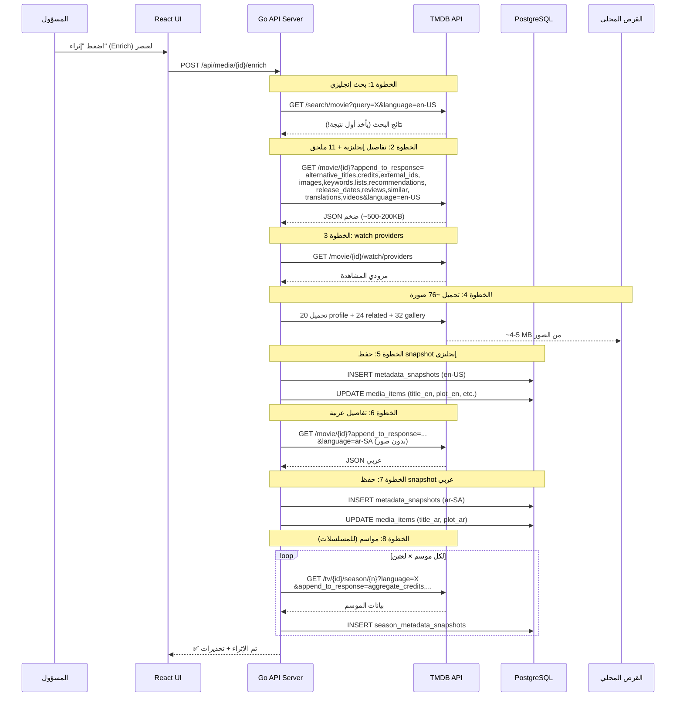

# 🎛️ إعادة هيكلة وبناء لوحة تحكم TMDB لنظام NEXORA

## الخلفية والمشكلة

نظام NEXORA يدير مكتبات وسائط ضخمة (100+ TB) للاستراحات وصالات الألعاب، ويعتمد على TMDB كمزود بيانات وصفية. **الوضع الحالي فيه فوضى** على عدة مستويات:

### المشاكل المكتشفة بعد دراسة الكود

| # | المشكلة | الملف المتأثر | الخطورة |
|---|---------|---------------|---------|
| 1 | **لا تمييز بين فيلم ومسلسل وأنمي في البحث**: الكود يحدد `mediaKind` بناءً على `query.Type`، لكن الأنمي مثل One Piece قد يُصنف كفيلم إذا أرسل النوع خطأ | [tmdb.go](file:///c:/Users/mousa/Desktop/project/NEXORA/server/internal/metadata/tmdb.go#L80-L83) | 🔴 حرج |
| 2 | **يختار أول نتيجة بحث بدون تقييم**: `payload.Results[0]` بدون أي نظام مطابقة ذكي أو درجة ثقة | [tmdb.go](file:///c:/Users/mousa/Desktop/project/NEXORA/server/internal/metadata/tmdb.go#L130) | 🔴 حرج |
| 3 | **تحميل صور ضخمة بلا حدود**: يحمّل 20 صورة profile + 12 poster recommendations + 12 similar + 12 gallery poster + 12 gallery backdrop + 8 logos = **~76 صورة لكل عنصر** | [tmdb.go](file:///c:/Users/mousa/Desktop/project/NEXORA/server/internal/metadata/tmdb.go#L355-L361) | 🔴 حرج |
| 4 | **لا يوجد نظام تحكم بالبيانات المجلوبة**: كل شيء يُجلب دائماً — لا مفاتيح تشغيل/إيقاف | [tmdb.go](file:///c:/Users/mousa/Desktop/project/NEXORA/server/internal/metadata/tmdb.go#L143-L150) | 🟡 متوسط |
| 5 | **لا حماية من 429 (Rate Limit)**: لا يوجد backoff أو retry، فقط يرمي خطأ | [tmdb.go](file:///c:/Users/mousa/Desktop/project/NEXORA/server/internal/metadata/tmdb.go#L118-L119) | 🟡 متوسط |
| 6 | **الصور تُحمّل مباشرة بدون خيار عرض من الإنترنت فقط**: لا خيار "عرض فقط بدون تحميل" | [cache.go](file:///c:/Users/mousa/Desktop/project/NEXORA/server/internal/metadata/cache.go#L16-L62) | 🟡 متوسط |
| 7 | **الكلمات المفتاحية تُخزن في `metadata_facets` لكن لا تُستخرج عربي/إنجليزي**: الكلمات تأتي إنجليزية فقط من TMDB | [repository.go](file:///c:/Users/mousa/Desktop/project/NEXORA/server/internal/db/repository.go#L1283) | 🟡 متوسط |
| 8 | **لا يوجد توثيق واضح لما يُحمّل فعلاً ولما يُعرض**: الـ Playbook موجود لكن الكود لا يطبقه بالضبط | [TMDB_METADATA_PLAYBOOK.md](file:///c:/Users/mousa/Desktop/project/NEXORA/docs/TMDB_METADATA_PLAYBOOK.md) | 🟡 متوسط |
| 9 | **مواسم الأنمي الطويل (1000+ حلقة) تستهلك طلبات كثيرة**: كل موسم = 2 طلبات (عربي + إنجليزي) | [server.go](file:///c:/Users/mousa/Desktop/project/NEXORA/server/internal/api/server.go#L1078-L1098) | 🟡 متوسط |
| 10 | **لا شاشة إدارة مخصصة لـ TMDB في الواجهة**: لا يوجد مكان يرى المسؤول إعدادات TMDB ويتحكم فيها | — | 🟡 متوسط |

---

## الحل المقترح: نظام TMDB مُعاد هيكلته + لوحة تحكم

### الفلسفة

> **"جلب أقل = نت أقل = سرعة أعلى = تحكم أكثر"**

المسؤول يقرر بالضبط ماذا يريد من TMDB عبر لوحة تحكم واضحة. النظام يجلب فقط ما هو مفعّل.

---

## User Review Required

> [!IMPORTANT]
> **القرار الأهم: هل تريد الصور تُحمّل محلياً أو تُعرض من الإنترنت؟**
> الخيارات المقترحة:
> - **الوضع المقترح (Hybrid)**: البوستر والخلفية الأساسية تُحمّل محلياً (للعمل أوفلاين)، أما صور الممثلين والحلقات والمقترحات تُعرض من URL مباشرة بدون تحميل. هذا يوفر 90% من استهلاك النت.
> - **وضع أوفلاين كامل**: كل شيء يُحمّل — يستهلك نت كثير لكن يعمل بدون إنترنت 100%.
> - **وضع إنترنت فقط**: لا يُحمّل شيء — كل الصور من URL. لا يعمل بدون إنترنت.

> [!WARNING]
> **مفتاح TMDB API ظاهر في ملف `.env` المرفوع على Git.**
> يجب حذفه فوراً من تاريخ Git وتوليد مفتاح جديد. هذا خرق أمني.

## Open Questions

> [!IMPORTANT]
> 1. **هل تريد لوحة تحكم TMDB كصفحة React مستقلة أو كتبويب داخل صفحة Admin الموجودة؟**
> 2. **هل تريد دعم عرض TMDB Configuration (أحجام الصور المتاحة) في اللوحة أو يكفي الإعدادات الافتراضية؟**
> 3. **هل فيه ميزانية معينة للإنترنت المستخدم في التحميل (مثلاً 500MB/يوم)؟**

---

## دراسة شاملة: ماذا يوفر TMDB بالضبط وماذا نحتاج

### 📊 خريطة البيانات الكاملة

```
┌─────────────────────────────────────────────────────────────────────┐
│                    بيانات TMDB المتاحة لكل عنصر                     │
├─────────────────────┬──────────────┬────────────┬──────────────────┤
│ البيان              │ الوضع الحالي │ نحتاجه؟   │ استهلاك النت     │
├─────────────────────┼──────────────┼────────────┼──────────────────┤
│ ① العنوان EN        │ ✅ يُجلب     │ ✅ أساسي   │ ≈0 (نص)          │
│ ② العنوان AR        │ ✅ يُجلب     │ ✅ أساسي   │ ≈0 (نص)          │
│ ③ الملخص EN         │ ✅ يُجلب     │ ✅ أساسي   │ ≈0 (نص)          │
│ ④ الملخص AR         │ ✅ يُجلب     │ ✅ أساسي   │ ≈0 (نص)          │
│ ⑤ التصنيفات (genres)│ ✅ يُجلب     │ ✅ أساسي   │ ≈0 (نص)          │
│ ⑥ التقييم           │ ✅ يُجلب     │ ✅ أساسي   │ ≈0 (نص)          │
│ ⑦ سنة الإصدار       │ ✅ يُجلب     │ ✅ أساسي   │ ≈0 (نص)          │
│ ⑧ البوستر الرئيسي   │ ✅ يُحمّل    │ ✅ أساسي   │ ~50-100KB/صورة   │
│ ⑨ الخلفية (backdrop) │ ✅ يُحمّل    │ ✅ أساسي   │ ~100-300KB/صورة  │
│ ⑩ الكلمات المفتاحية │ ✅ جزئي      │ ✅ للبحث    │ ≈0 (نص)          │
│ ⑪ عدد المواسم       │ ✅ يُجلب     │ ✅ أساسي   │ ≈0 (نص)          │
│ ⑫ عدد الحلقات/موسم  │ ✅ يُجلب     │ ✅ أساسي   │ ≈0 (نص)          │
├─────────────────────┼──────────────┼────────────┼──────────────────┤
│ ⑬ صور الممثلين      │ ✅ 20 صورة   │ ❌ اختياري │ ~20×30KB=600KB   │
│ ⑭ صور المقترحات     │ ✅ 12+12 صورة│ ❌ اختياري │ ~24×50KB=1.2MB   │
│ ⑮ صور المعرض (gallery)│ ✅ 12+12+8  │ ❌ اختياري │ ~32×80KB=2.5MB   │
│ ⑯ صور الحلقات (stills)│ ❌ لا يُجلب │ ❌ اختياري │ ~عشرات MB        │
│ ⑰ صور المواسم       │ ❌ لا يُجلب  │ ❌ اختياري │ ~عشرات KB        │
│ ⑱ الفيديوهات/تريلر  │ ✅ روابط فقط │ ✅ مفيد    │ ≈0 (روابط)       │
│ ⑲ طاقم العمل (نصوص) │ ✅ يُجلب     │ ✅ مفيد    │ ≈0 (نص)          │
│ ⑳ المعرّفات الخارجية│ ✅ يُجلب     │ ✅ مفيد    │ ≈0 (نص)          │
│ ㉑ التوصيات/المشابه  │ ✅ يُجلب     │ ❓ اختياري │ ≈0 (نص)          │
│ ㉒ تصنيف المحتوى    │ ✅ يُجلب     │ ✅ مفيد    │ ≈0 (نص)          │
│ ㉓ مزودي المشاهدة   │ ✅ يُجلب     │ ❌ لا نحتاج│ ≈0 (نص)          │
│ ㉔ المراجعات         │ ✅ يُجلب     │ ❌ لا نحتاج│ ≈0 (نص)          │
│ ㉕ الترجمات (metadata)│ ✅ يُجلب    │ ✅ للبحث   │ ≈0 (نص)          │
└─────────────────────┴──────────────┴────────────┴──────────────────┘

⚡ الاستهلاك الحالي لعنصر واحد: ~4-5 MB (بسبب 76 صورة)
⚡ الاستهلاك المقترح لعنصر واحد: ~150-400 KB (بوستر + خلفية فقط)
📉 تقليل بنسبة ~90-95% في استهلاك النت
```

### 🔄 كيف يجلب النظام البيانات حالياً (تحليل التدفق)



### 📊 حساب استهلاك الطلبات

| السيناريو | عدد طلبات TMDB | حجم البيانات |
|-----------|---------------|-------------|
| إثراء فيلم واحد | 4 طلبات (بحث + تفاصيل EN + providers + تفاصيل AR) + ~76 تحميل صورة | ~5 MB |
| إثراء مسلسل (5 مواسم) | 4 + (5×2 مواسم) = 14 طلب + ~76 صورة | ~5-6 MB |
| إثراء أنمي (20 موسم) | 4 + (20×2 مواسم) = 44 طلب + ~76 صورة | ~6-8 MB |
| إثراء 100 عنصر | 400-4400 طلب + ~7600 صورة | ~500 MB - 1 GB |
| **بعد التحسين**: إثراء 100 عنصر | 400-4400 طلب + ~200 صورة أساسية فقط | ~15-40 MB |

---

## Proposed Changes

### المكون 1: نظام إعدادات TMDB (Backend)

#### [MODIFY] [config.go](file:///c:/Users/mousa/Desktop/project/NEXORA/server/internal/config/config.go)

إضافة إعدادات تحكم جديدة لـ TMDB:

```go
// إعدادات جديدة في Config struct
TMDBFetchMode         string   // "essential" | "standard" | "full"
TMDBImageMode         string   // "local" | "remote" | "hybrid"
TMDBEnabledModules    []string // ["poster","backdrop","genres","keywords","cast_text","seasons","trailers"]
TMDBDisabledModules   []string // ["cast_images","gallery","recommendations_images","similar_images","reviews","watch_providers"]
TMDBMaxCastImages     int      // 0 = لا تحمّل | -1 = الافتراضي
TMDBMaxGalleryImages  int      // 0 = لا تحمّل
TMDBMaxRelatedPosters int      // 0 = لا تحمّل
TMDBSeasonFetchMode   string   // "metadata_only" | "with_images" | "with_stills"
```

متغيرات البيئة الجديدة:
```env
NEXORA_TMDB_FETCH_MODE=essential          # essential | standard | full
NEXORA_TMDB_IMAGE_MODE=hybrid             # local | remote | hybrid
NEXORA_TMDB_MAX_CAST_IMAGES=0             # عدد صور الممثلين (0=لا شيء)
NEXORA_TMDB_MAX_GALLERY_IMAGES=0          # عدد صور المعرض (0=لا شيء)
NEXORA_TMDB_MAX_RELATED_POSTERS=0         # عدد بوسترات المقترحات (0=لا شيء)
NEXORA_TMDB_SEASON_FETCH_MODE=metadata_only  # metadata_only | with_images
```

---

#### [NEW] `server/internal/metadata/tmdb_settings.go`

ملف جديد يحتوي على نظام الوحدات القابلة للتفعيل/الإيقاف:

```go
// TMDBFetchProfile يحدد ما يُجلب لكل وضع
type TMDBFetchProfile struct {
    Name        string
    Description string
    
    // البيانات النصية
    FetchTitle           bool // العنوان EN + AR
    FetchOverview        bool // الملخص EN + AR  
    FetchGenres          bool // التصنيفات
    FetchKeywords        bool // الكلمات المفتاحية
    FetchCastText        bool // أسماء الممثلين (نص فقط)
    FetchExternalIDs     bool // معرّفات IMDb/TVDB
    FetchTranslations    bool // الترجمات المتاحة
    FetchContentRatings  bool // تصنيف المحتوى
    FetchTrailers        bool // روابط فيديوهات
    FetchRecommendations bool // قوائم المقترحات (نص فقط)
    FetchSimilar         bool // قوائم المشابه (نص فقط)
    FetchReviews         bool // المراجعات
    FetchWatchProviders  bool // مزودي المشاهدة
    FetchAlternativeTitles bool // عناوين بديلة
    FetchReleaseDates    bool // تواريخ الإصدار
    
    // الصور
    FetchPoster          bool // بوستر رئيسي واحد
    FetchBackdrop        bool // خلفية رئيسية واحدة
    MaxCastImages        int  // عدد صور الممثلين
    MaxGalleryPosters    int  // عدد بوسترات المعرض
    MaxGalleryBackdrops  int  // عدد خلفيات المعرض
    MaxGalleryLogos      int  // عدد الشعارات
    MaxRelatedPosters    int  // عدد بوسترات المقترحات
    
    // المواسم
    FetchSeasonMetadata  bool // أسماء/أرقام المواسم والحلقات
    FetchSeasonImages    bool // صور المواسم
    FetchEpisodeStills   bool // صور الحلقات
    
    // طريقة عرض الصور
    ImageMode            string // "local" | "remote" | "hybrid"
}
```

**الأوضاع الثلاثة:**

| الوضع | ماذا يجلب | حجم التحميل | مناسب لـ |
|-------|----------|-------------|---------|
| **essential** (الأساسي) | العنوان + الملخص + التصنيفات + التقييم + بوستر + خلفية + عدد المواسم/الحلقات + الكلمات المفتاحية | ~150-400 KB | **مقاهي بنت محدود** |
| **standard** (القياسي) | essential + الممثلين (نص) + تريلرات + معرّفات خارجية + توصيات (نص) + ترجمات + تصنيف المحتوى | ~400 KB (بدون صور إضافية) | **الاستخدام الموصى** |
| **full** (الكامل) | standard + صور ممثلين + معرض صور + بوسترات مقترحات + مراجعات + watch providers | ~4-5 MB | **نت مفتوح** |

---

#### [MODIFY] [tmdb.go](file:///c:/Users/mousa/Desktop/project/NEXORA/server/internal/metadata/tmdb.go)

التعديلات الرئيسية:

1. **نظام `append_to_response` ديناميكي**: بدلاً من سلسلة ثابتة، يبني القائمة بناءً على الإعدادات المفعّلة:

```go
func (c *TMDBClient) buildAppendList(mediaKind string, profile TMDBFetchProfile) string {
    parts := []string{}
    if profile.FetchCastText {
        if mediaKind == "tv" {
            parts = append(parts, "aggregate_credits")
        } else {
            parts = append(parts, "credits")
        }
    }
    if profile.FetchPoster || profile.FetchBackdrop || profile.MaxGalleryPosters > 0 {
        parts = append(parts, "images")
    }
    if profile.FetchTrailers {
        parts = append(parts, "videos")
    }
    if profile.FetchKeywords {
        parts = append(parts, "keywords")
    }
    // ... وهكذا لكل وحدة
    return strings.Join(parts, ",")
}
```

2. **نظام مطابقة ذكي**: بدلاً من اختيار أول نتيجة:

```go
func (c *TMDBClient) bestMatch(candidates []tmdbResult, query Query) (tmdbResult, float64) {
    // حساب درجة ثقة لكل مرشح بناءً على:
    // - تطابق الاسم (normalized)
    // - تقارب السنة  
    // - الشعبية (عامل ثانوي)
    // إرجاع المرشح الأفضل + درجة الثقة (0.0-1.0)
}
```

3. **تحميل صور حسب الإعدادات فقط**:

```go
func (c *TMDBClient) cacheDetailImages(ctx context.Context, raw json.RawMessage, profile TMDBFetchProfile) (json.RawMessage, []string) {
    // فقط يحمّل ما هو مفعّل في profile
    if profile.MaxCastImages > 0 {
        cacheEntries("credits", "cast", ..., profile.MaxCastImages)
    }
    // بدلاً من الـ 76 صورة الثابتة
}
```

4. **دعم وضع "remote" للصور**: إرجاع URL بدون تحميل:

```go
func (c *TMDBClient) resolveImageURL(path string, size string, mode string) string {
    if mode == "remote" {
        // يرجع رابط TMDB المباشر بدون تحميل محلي
        return c.imageURL(size, path)
    }
    // يحمّل محلياً
    return cached
}
```

5. **حماية Rate Limit**:

```go
func (c *TMDBClient) doWithBackoff(ctx context.Context, req *http.Request) (*http.Response, error) {
    for attempt := 0; attempt < 5; attempt++ {
        resp, err := c.client.Do(req)
        if err != nil { return nil, err }
        if resp.StatusCode != 429 { return resp, nil }
        resp.Body.Close()
        
        // Exponential backoff with jitter
        wait := time.Duration(1<<attempt) * time.Second
        jitter := time.Duration(rand.Intn(1000)) * time.Millisecond
        select {
        case <-ctx.Done(): return nil, ctx.Err()
        case <-time.After(wait + jitter):
        }
    }
    return nil, fmt.Errorf("tmdb rate limited after retries")
}
```

---

#### [MODIFY] [cache.go](file:///c:/Users/mousa/Desktop/project/NEXORA/server/internal/metadata/cache.go)

- إضافة `sha256` checksum عند التحميل
- كتابة ذرية (temp file → rename) بدل الكتابة المباشرة
- حفظ `Content-Type` و`fetched_at`

---

#### [NEW] `server/internal/metadata/tmdb_stats.go`

ملف لحساب إحصائيات استهلاك TMDB:

```go
type TMDBUsageStats struct {
    TotalAPIRequests      int64     // إجمالي الطلبات
    TotalImagesDownloaded int64     // عدد الصور المحملة
    TotalBytesDownloaded  int64     // إجمالي البايتات المحملة
    LastRequestAt         time.Time // آخر طلب
    RequestsToday         int64     // طلبات اليوم
    RequestsThisMonth     int64     // طلبات هذا الشهر
    EnrichedItems         int64     // العناصر المُثراة
    PendingItems          int64     // العناصر بدون metadata
    ExpiredItems          int64     // العناصر منتهية الصلاحية
}
```

---

### المكون 2: API Endpoints جديدة

#### [MODIFY] [server.go](file:///c:/Users/mousa/Desktop/project/NEXORA/server/internal/api/server.go)

إضافة endpoints جديدة:

```go
// لوحة تحكم TMDB
s.mux.HandleFunc("GET  /api/tmdb/settings",    s.handleTMDBSettings)     // إعدادات TMDB الحالية
s.mux.HandleFunc("PUT  /api/tmdb/settings",    s.handleTMDBSettingsUpdate) // تحديث الإعدادات
s.mux.HandleFunc("GET  /api/tmdb/stats",       s.handleTMDBStats)         // إحصائيات الاستخدام
s.mux.HandleFunc("GET  /api/tmdb/modules",     s.handleTMDBModules)       // الوحدات المتاحة وحالتها
s.mux.HandleFunc("PUT  /api/tmdb/modules",     s.handleTMDBModulesUpdate) // تفعيل/إيقاف وحدة
s.mux.HandleFunc("POST /api/tmdb/test",        s.handleTMDBTest)          // اختبار الاتصال
s.mux.HandleFunc("GET  /api/tmdb/preview/{id}", s.handleTMDBPreview)     // معاينة ماذا سيُجلب
s.mux.HandleFunc("GET  /api/tmdb/data-map",    s.handleTMDBDataMap)       // خريطة البيانات الكاملة
```

**تفاصيل كل endpoint:**

| Endpoint | الوظيفة | المدخلات | المخرجات |
|----------|---------|---------|---------|
| `GET /api/tmdb/settings` | إرجاع الإعدادات الحالية | — | `{fetchMode, imageMode, modules: [...], limits: {...}}` |
| `PUT /api/tmdb/settings` | تحديث الإعدادات | `{fetchMode: "essential", imageMode: "hybrid"}` | الإعدادات المحدّثة |
| `GET /api/tmdb/stats` | إحصائيات الاستخدام | — | `{requests_today, images_downloaded, bytes_total, ...}` |
| `GET /api/tmdb/modules` | الوحدات المتاحة | — | `[{name, description, enabled, estimatedBandwidth}]` |
| `PUT /api/tmdb/modules` | تفعيل/إيقاف | `{module: "cast_images", enabled: false}` | الوحدات المحدّثة |
| `POST /api/tmdb/test` | اختبار الاتصال | — | `{connected, plan, rateLimit, apiVersion}` |
| `GET /api/tmdb/preview/{id}` | معاينة قبل الجلب | `?type=movie` | `{willFetch: [...], estimatedRequests, estimatedBytes}` |
| `GET /api/tmdb/data-map` | خريطة البيانات | — | قائمة كاملة بكل بيان TMDB + هل مفعّل + هل مخزّن |

---

### المكون 3: لوحة تحكم TMDB (Frontend React)

#### [NEW] `client/src/pages/TMDBSettingsPage.jsx`

صفحة React جديدة تحتوي على:

**القسم 1: حالة الاتصال**
- مؤشر اتصال (متصل/غير متصل/خطأ)
- معلومات الخطة (مجانية)
- آخر طلب ناجح

**القسم 2: وضع الجلب (Fetch Mode)**
- 3 بطاقات: Essential / Standard / Full
- وصف لكل وضع + حجم التحميل المتوقع
- زر اختيار

**القسم 3: وحدات البيانات (Data Modules)**
جدول/بطاقات لكل وحدة بيانات مع مفتاح تشغيل/إيقاف:

| الوحدة | الوصف | الحالة | حجم التحميل | تفعيل |
|--------|-------|--------|------------|-------|
| 🎬 العنوان والملخص | الاسم EN/AR + القصة EN/AR | أساسي (لا يُقفل) | ~0 | ✅ |
| 🏷️ التصنيفات | أكشن، دراما، كوميديا... | أساسي | ~0 | ✅ |
| ⭐ التقييم | تقييم TMDB | أساسي | ~0 | ✅ |
| 🖼️ البوستر الرئيسي | صورة واحدة (عربي ← إنجليزي) | أساسي | ~80KB | ✅ |
| 🌄 الخلفية | صورة واحدة | أساسي | ~200KB | ✅ |
| 🔑 الكلمات المفتاحية | keywords EN + AR للبحث | للبحث | ~0 | ✅ |
| 📺 عدد المواسم/الحلقات | أرقام فقط، بدون صور | أساسي | ~0 | ✅ |
| 🎭 طاقم العمل (نص) | أسماء الممثلين والمخرجين | قياسي | ~0 | ⬜ |
| 🎭 صور الممثلين | صور profile | ثقيل | ~600KB | ⬜ |
| 🎬 التريلرات | روابط YouTube | قياسي | ~0 | ⬜ |
| 🔗 معرّفات خارجية | IMDb, TVDB | قياسي | ~0 | ⬜ |
| 📝 الترجمات المتاحة | ترجمات metadata | قياسي | ~0 | ⬜ |
| 🔞 تصنيف المحتوى | PG-13, R, etc. | قياسي | ~0 | ⬜ |
| 👍 التوصيات (نص) | أسماء أعمال مقترحة | قياسي | ~0 | ⬜ |
| 👍 صور التوصيات | بوسترات المقترحات | ثقيل | ~1.2MB | ⬜ |
| 🖼️ معرض الصور | بوسترات + خلفيات إضافية | ثقيل | ~2.5MB | ⬜ |
| 📝 المراجعات | مراجعات المستخدمين | اختياري | ~0 | ⬜ |
| 📺 مزودي المشاهدة | Netflix, etc. | اختياري | ~0 | ⬜ |

**القسم 4: وضع الصور (Image Mode)**
- 🌐 **من الإنترنت (Remote)**: الصور تُعرض مباشرة من TMDB CDN — لا تُحمّل
- 💾 **تحميل محلي (Local)**: كل الصور تُحمّل للقرص — للعمل أوفلاين
- 🔄 **هجين (Hybrid)**: البوستر والخلفية تُحمّل، الباقي من الإنترنت

**القسم 5: إحصائيات الاستهلاك**
- عدد الطلبات اليوم / هذا الشهر
- حجم الصور المحملة
- عدد العناصر المُثراة / بدون بيانات / منتهية الصلاحية
- رسم بياني بسيط (اختياري)

**القسم 6: معاينة البيانات**
- اختر عنصر → شاهد ماذا سيُجلب من TMDB بالضبط قبل الجلب
- عرض حجم التحميل المتوقع

---

#### [MODIFY] [Sidebar.jsx](file:///c:/Users/mousa/Desktop/project/NEXORA/client/src/components/Sidebar.jsx)

إضافة رابط "إعدادات TMDB" في القائمة الجانبية تحت قسم الإدارة.

---

#### [MODIFY] `client/src/App.jsx`

إضافة route جديد `/admin/tmdb` لصفحة إعدادات TMDB.

---

#### [MODIFY] [api.js](file:///c:/Users/mousa/Desktop/project/NEXORA/client/src/lib/api.js)

إضافة دوال API جديدة:

```javascript
export const tmdbAPI = {
    getSettings:    () => get('/api/tmdb/settings'),
    updateSettings: (data) => put('/api/tmdb/settings', data),
    getStats:       () => get('/api/tmdb/stats'),
    getModules:     () => get('/api/tmdb/modules'),
    updateModules:  (data) => put('/api/tmdb/modules', data),
    testConnection: () => post('/api/tmdb/test'),
    previewEnrich:  (id, type) => get(`/api/tmdb/preview/${id}?type=${type}`),
    getDataMap:     () => get('/api/tmdb/data-map'),
};
```

---

### المكون 4: قاعدة البيانات

#### [NEW] `server/migrations/0008_add_tmdb_settings.sql`

```sql
-- جدول إعدادات TMDB (singleton)
CREATE TABLE IF NOT EXISTS tmdb_settings (
    id INT PRIMARY KEY DEFAULT 1 CHECK (id = 1),
    fetch_mode VARCHAR(20) NOT NULL DEFAULT 'essential',
    image_mode VARCHAR(20) NOT NULL DEFAULT 'hybrid',
    max_cast_images INT NOT NULL DEFAULT 0,
    max_gallery_images INT NOT NULL DEFAULT 0,
    max_related_posters INT NOT NULL DEFAULT 0,
    season_fetch_mode VARCHAR(30) NOT NULL DEFAULT 'metadata_only',
    modules_config JSONB NOT NULL DEFAULT '{}'::jsonb,
    updated_at TIMESTAMP NOT NULL DEFAULT CURRENT_TIMESTAMP
);

-- جدول إحصائيات TMDB
CREATE TABLE IF NOT EXISTS tmdb_usage_log (
    id BIGSERIAL PRIMARY KEY,
    request_type VARCHAR(50) NOT NULL,
    endpoint VARCHAR(200) NOT NULL,
    media_item_id INT REFERENCES media_items(id) ON DELETE SET NULL,
    response_status INT,
    bytes_downloaded BIGINT DEFAULT 0,
    images_downloaded INT DEFAULT 0,
    created_at TIMESTAMP NOT NULL DEFAULT CURRENT_TIMESTAMP
);

CREATE INDEX IF NOT EXISTS idx_tmdb_usage_log_date
    ON tmdb_usage_log (created_at);

-- تهيئة الإعدادات الافتراضية
INSERT INTO tmdb_settings (id) VALUES (1) ON CONFLICT DO NOTHING;
```

---

### المكون 5: إصلاح مشكلة التصنيف (فيلم vs مسلسل vs أنمي)

#### [MODIFY] [tmdb.go](file:///c:/Users/mousa/Desktop/project/NEXORA/server/internal/metadata/tmdb.go)

إضافة نظام كشف ذكي:

```go
// إذا كان النوع "anime" ولم تجد نتائج في search/tv، 
// جرّب search/movie (بعض الأنمي أفلام)
func (c *TMDBClient) SmartLookup(ctx context.Context, query Query) (Result, error) {
    // 1. جرّب بالنوع المحدد أولاً
    result, err := c.Lookup(ctx, query)
    if err == nil { return result, nil }
    
    // 2. إذا فشل وكان أنمي، جرّب movie
    if query.Type == "anime" {
        altQuery := query
        altQuery.Type = "movie"
        result, err = c.Lookup(ctx, altQuery)
        if err == nil {
            result.Warnings = append(result.Warnings, "تم العثور كفيلم وليس مسلسل")
            return result, nil
        }
    }
    
    // 3. إذا فشل وكان movie، جرّب tv
    if query.Type == "movie" {
        altQuery := query
        altQuery.Type = "tv"
        result, err = c.Lookup(ctx, altQuery)
        if err == nil {
            result.Warnings = append(result.Warnings, "تم العثور كمسلسل وليس فيلم")
            return result, nil
        }
    }
    
    return Result{}, ErrNotFound
}
```

---

### المكون 6: توثيق محدّث

#### [MODIFY] [TMDB_METADATA_PLAYBOOK.md](file:///c:/Users/mousa/Desktop/project/NEXORA/docs/TMDB_METADATA_PLAYBOOK.md)

تحديث شامل يتضمن:
- جدول كل بيان متاح + هل مفعّل + هل يُخزن + أين يُعرض
- رسم تدفق البيانات المحدّث
- إرشادات لوحة التحكم
- أمثلة على الاستهلاك لكل وضع

---

## Verification Plan

### Automated Tests

```bash
# اختبار وحدات TMDB الجديدة
cd server && go test ./internal/metadata/... -v -run TestTMDB

# اختبار API endpoints الجديدة
cd server && go test ./internal/api/... -v -run TestTMDBSettings

# بناء المشروع بدون أخطاء
cd server && go build ./cmd/api
cd client && npm run build
```

### Manual Verification

1. **اختبار لوحة التحكم**: فتح `/admin/tmdb` والتأكد من عرض كل الوحدات
2. **اختبار التفعيل/الإيقاف**: تفعيل وإيقاف وحدة والتأكد من أن الـ Enrich يحترم الإعداد
3. **اختبار أوضاع الصور**: تجربة الأوضاع الثلاثة (local/remote/hybrid)
4. **اختبار المعاينة**: معاينة عنصر قبل الإثراء والتأكد من الحجم المتوقع
5. **اختبار الإحصائيات**: التأكد من تسجيل الطلبات والاستهلاك
6. **اختبار Rate Limit**: محاكاة 429 والتأكد من الـ backoff

---

## ملخص المهام للتنفيذ

### المرحلة 1: البنية التحتية (Backend)
- [ ] 1.1 إنشاء `tmdb_settings.go` — نظام الأوضاع والوحدات
- [ ] 1.2 إنشاء migration `0008_add_tmdb_settings.sql`
- [ ] 1.3 تعديل `config.go` — إضافة متغيرات بيئة جديدة
- [ ] 1.4 تعديل `tmdb.go` — `append_to_response` ديناميكي
- [ ] 1.5 تعديل `tmdb.go` — نظام مطابقة ذكي (بدل أول نتيجة)
- [ ] 1.6 تعديل `tmdb.go` — Smart Lookup (فيلم/مسلسل/أنمي)
- [ ] 1.7 تعديل `tmdb.go` — `cacheDetailImages` حسب الإعدادات
- [ ] 1.8 تعديل `cache.go` — دعم وضع remote + كتابة ذرية
- [ ] 1.9 إنشاء `tmdb_stats.go` — تسجيل الإحصائيات
- [ ] 1.10 تعديل `tmdb.go` — Rate Limit backoff

### المرحلة 2: API Endpoints
- [ ] 2.1 إضافة `handleTMDBSettings` (GET + PUT)
- [ ] 2.2 إضافة `handleTMDBModules` (GET + PUT)
- [ ] 2.3 إضافة `handleTMDBStats` (GET)
- [ ] 2.4 إضافة `handleTMDBTest` (POST)
- [ ] 2.5 إضافة `handleTMDBPreview` (GET)
- [ ] 2.6 إضافة `handleTMDBDataMap` (GET)
- [ ] 2.7 تعديل `handleMediaEnrich` — استخدام الإعدادات الجديدة
- [ ] 2.8 إضافة repository functions للإعدادات والإحصائيات

### المرحلة 3: واجهة React
- [ ] 3.1 إنشاء `TMDBSettingsPage.jsx` — الصفحة الرئيسية
- [ ] 3.2 إنشاء مكون "حالة الاتصال"
- [ ] 3.3 إنشاء مكون "اختيار وضع الجلب" (3 بطاقات)
- [ ] 3.4 إنشاء مكون "وحدات البيانات" (جدول مع switches)
- [ ] 3.5 إنشاء مكون "وضع الصور" (3 خيارات)
- [ ] 3.6 إنشاء مكون "الإحصائيات"
- [ ] 3.7 إنشاء مكون "معاينة الإثراء"
- [ ] 3.8 تعديل `Sidebar.jsx` — إضافة رابط
- [ ] 3.9 تعديل `App.jsx` — إضافة route
- [ ] 3.10 تعديل `api.js` — دوال API جديدة

### المرحلة 4: التوثيق والاختبارات
- [ ] 4.1 تحديث `TMDB_METADATA_PLAYBOOK.md`
- [ ] 4.2 كتابة اختبارات Go للإعدادات الجديدة
- [ ] 4.3 كتابة اختبارات Go لنظام المطابقة الذكي
- [ ] 4.4 كتابة اختبارات Go لـ Rate Limit backoff
- [ ] 4.5 تحديث `.env.example` بالمتغيرات الجديدة

### المرحلة 5: أمان
- [ ] 5.1 ⚠️ حذف مفتاح TMDB من تاريخ Git
- [ ] 5.2 توليد مفتاح TMDB جديد
- [ ] 5.3 التأكد من عدم تسريب المفتاح في أي استجابة API
