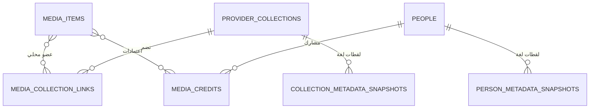

# السلاسل السينمائية والأشخاص — تصميم محلي أولاً

## القرار المختصر

نعم، نضيف جداول جديدة مستقلة للسلاسل والأشخاص. لا نستخدم جدول `collections` الموجود حالياً، لأنه مخصص لتجميعات NEXORA التحريرية وقواعد العرض اليدوية، وليس هوية سلسلة آتية من مزود بيانات.

المفتاح الصحيح هو **معرف المزود الثابت** (`tmdb_collection_id` أو `tmdb_person_id`) وليس الاسم العربي أو الإنجليزي. الأسماء قابلة للترجمة والتعديل والتكرار، بينما المعرف هو ما يحافظ على الترابط عند إعادة الفهرسة أو تحديث TMDB.

كل صفحات العرض تستعلم من PostgreSQL والملفات المحلية فقط. الاتصال بـ TMDB يحصل حصراً في مهمة الإثراء اليدوي أو الجماعي، ثم تحفظ النتائج والصور محلياً بحسب إعدادات الإدارة.

## ما هو موجود فعلاً الآن

- `media_items.metadata_external_id` يحفظ معرف العمل لدى المزود.
- `metadata_snapshots` تحفظ وثيقة TMDB كاملة لكل لغة محلياً.
- `metadata_facets` تحفظ نسخة صغيرة مفهرسة من الحقول المستقرة، وتتضمن حالياً `belongs_to_collection` للفيلم.
- `collections` و`collection_items` مخصصان للتجميعات التحريرية وواجهات العرض؛ لا يصلحان لتمثيل سلسلة TMDB.
- بيانات `credits` تُفكك إلى علاقات أشخاص محلية قابلة للبحث عند الإثراء أو عند إعادة البناء من اللقطات القديمة.

## حالة التنفيذ الفعلية — 25 أغسطس 2026

تم تنفيذ أساس هذه الخطة في migration `0011_add_provider_collections_people.sql`، وهو يضيف الجداول الستة التالية: `provider_collections`، `media_collection_links`، `collection_metadata_snapshots`، `people`، `media_credits`، و`person_metadata_snapshots`.

التنفيذ الحالي يضمن الآتي:

- `POST /api/media/{id}/enrich` يحفظ لقطة TMDB المحلية ثم يستخرج تلقائياً سلسلة الفيلم وطاقمه؛ لا يغيّر `video_files` أو بيانات المواسم المحلية.
- `POST /api/admin/catalog/sync-relations` يعيد بناء الشبكة من `metadata_snapshots` فقط. لا يستدعي TMDB ولا يحتاج مفتاحاً أو اتصالاً بالإنترنت، وهو آمن لإعادته مرات عدة.
- اللغة الإنجليزية تُحفظ من لقطة `en-US` والعربية من `ar-SA`، ولا تستبدل إحداهما الأخرى عند إعادة المزامنة.
- بطاقات وصفحات السلاسل والأشخاص تقرأ من PostgreSQL عبر API المحلي فقط؛ تظهر الشخصيات فقط عند وجود عملين محليين على الأقل، ما لم تُبرز لاحقاً من الإدارة.
- صور الأشخاص لا تحفظ في جدول العرض إلا إذا كانت قد خُزنت محلياً تحت `/assets/images/...`. لا يتحول التصفح إلى تحميل صامت من TMDB.

### نتيجة تحقق واقعي على قاعدة البيانات

بعد تشغيل `sync-relations` على المكتبة الحالية تمت معالجة **98** لقطة TMDB محلية، وإنشاء/تأكيد **14** رابط سلسلة و**1,141** رابط اعتماد، منها **849** علاقة من `aggregate_credits` الخاصة بالمسلسلات والأنمي. ظهرت سلسلة محلية مكتملة الشروط للعرض هي `Spider-Man (MCU) Collection` بعدد جزأين متاحين، كما ظهرت صفحات أشخاص مرتبطة بأعمالهم المتاحة فقط. وبعد إثراء أحد أفلامها حُفظت تفاصيل السلسلة باللغتين، وعدد أجزائها الرسمي (`4`)، وصورتا البوستر والخلفية محلياً.

## حدود TMDB التي نبني عليها

| المجال | المصدر أثناء الإثراء | الهوية الصحيحة | ملاحظة |
|---|---|---|---|
| سلسلة فيلم | `belongs_to_collection` في تفاصيل الفيلم | `collection.id` | موجود للفيلم فقط؛ لا نعتمد الاسم أبداً.
| تفاصيل السلسلة | `/collection/{collection_id}` بالعربية ثم الإنجليزية | `collection_id` | يوفر الاسم والوصف والأجزاء والصورة/الخلفية.
| صور السلسلة | تفاصيل السلسلة أو `/collection/{id}/images` عند الحاجة | مسار الصورة + `collection_id` | تحفظ محلياً وفق وضع الصور.
| ممثلو الفيلم | `credits` ضمن تفاصيل الفيلم أو `/movie/{id}/credits` | `person.id` و`credit_id` | الدور/اسم الشخصية يخص الاعتماد، لا الشخص نفسه.
| الشخص | `/person/{person_id}` عند فتحه أو تحديثه | `person_id` | ليس مطلوباً لكل ممثل أثناء كل إثراء.
| أعمال الشخص | العلاقات المحلية في `media_credits` | `media_item_id + person_id` | نعرض الأعمال الموجودة في مكتبة NEXORA فقط، بلا تحميل فيلموغرافيا من الإنترنت أثناء التصفح.

توثيق TMDB يؤكد أن تفاصيل الفيلم تُجلب بالمعرف وأن `append_to_response` يقلل الطلبات بضم نتائج فرعية، وأن تفاصيل السلسلة والأشخاص والاعتمادات لها endpoints مستقلة. [Movie details](https://developer.themoviedb.org/reference/movie-details)، [Collection details](https://developer.themoviedb.org/reference/collection-details)، [Movie credits](https://developer.themoviedb.org/reference/movie-credits)، [Person details](https://developer.themoviedb.org/reference/person-details).

## نموذج قاعدة البيانات المقترح



### 1. `provider_collections`

تمثل سلسلة أفلام/فرنشايز من مزود خارجي، منفصلة تماماً عن `collections` التحريرية.

| الحقل | الغرض |
|---|---|
| `id` | المفتاح المحلي |
| `provider` | `tmdb` الآن، قابل للتوسع لاحقاً |
| `external_id` | معرف سلسلة TMDB؛ فريد مع المزود |
| `kind` | `movie_collection` الآن؛ يفتح المجال لسلاسل أخرى لاحقاً |
| `title_ar`, `title_en` | أحدث نصين محليين مع حفظ اللغة الصحيحة |
| `overview_ar`, `overview_en` | وصفان محليان |
| `poster_path`, `backdrop_path` | مسار محلي أو رابط فقط إذا سمحت الإدارة بوضع remote |
| `parts_count`, `local_item_count` | عدد أجزاء TMDB وعدد الأجزاء الموجودة محلياً |
| `metadata_fetched_at`, `metadata_expires_at` | مراقبة حداثة البيانات، لا لاستدعاء الشبكة عند العرض |
| `is_featured`, `is_hidden`, `sort_priority` | تحكم إداري محلي |

قيد فريد: `UNIQUE(provider, external_id)`.

### 2. `media_collection_links`

رابط كثير-إلى-كثير بدلاً من عمود بسيط داخل `media_items`. TMDB يضع الفيلم عادة في سلسلة واحدة، لكن الرابط المرن يسمح لاحقاً بتصحيح إداري أو عضويات محلية إضافية بلا كسر التصميم.

| الحقل | الغرض |
|---|---|
| `media_item_id` | العمل المحلي |
| `collection_id` | السلسلة المحلية |
| `source` | `tmdb` أو `manual` |
| `tmdb_order` | ترتيب الجزء المشتق من قائمة `parts` عندما يتوفر |
| `linked_at`, `verified_at` | تدقيق وإعادة مزامنة |

القيد: `PRIMARY KEY(media_item_id, collection_id)`.

### 3. `collection_metadata_snapshots`

نفس فلسفة `metadata_snapshots`: وثيقة TMDB خام محلية لكل لغة، مع `UNIQUE(collection_id, provider, locale)`. لا نضع كل JSON في الجدول الأساسي.

### 4. `people`

يمثل شخصاً حقيقياً: ممثل، مخرج، كاتب… وليس شخصية خيالية.

| الحقل | الغرض |
|---|---|
| `id` | مفتاح محلي |
| `provider`, `external_id` | هوية TMDB ثابتة وفريدة |
| `name_ar`, `name_en` | الاسمان المحليان |
| `known_for_department` | `Acting`, `Directing`… |
| `profile_path` | لا يحفظ إلا إذا فعّلته الإدارة |
| `popularity`, `is_featured`, `is_hidden` | انتقاء الواجهات بلا إغراق |
| `metadata_fetched_at`, `metadata_expires_at` | متابعة الحداثة |

### 5. `media_credits`

العلاقة الحقيقية بين عملنا والشخص، وهي ما يجعل صفحة الشخص تعمل بلا نت.

| الحقل | الغرض |
|---|---|
| `media_item_id`, `person_id` | طرفا العلاقة |
| `provider_credit_id` | مفتاح TMDB للاعتماد عند وجوده |
| `credit_kind` | `cast` أو `crew` |
| `character_name` | اسم الشخصية داخل هذا العمل فقط |
| `job`, `department` | مخرج/كاتب/إنتاج… |
| `billing_order` | ترتيب الظهور |
| `source`, `verified_at` | أصل المعلومة وتاريخها |

قيد فريد عملي: `UNIQUE(media_item_id, provider_credit_id)` عند وجود `credit_id`، وفهرس على `person_id, media_item_id`.

### الشخصيات الخيالية

لا ننشئ في المرحلة الأولى جدولاً عاماً لـ «الشخصية». TMDB يعطي غالباً اسم الشخصية داخل الـcredit لكنه لا يضمن هوية عالمية موحدة للشخصية عبر كل فيلم. لذلك صفحة «Spider-Man» الكاملة تحتاج ربطاً تحريرياً محلياً لاحقاً (`fictional_characters` + aliases + credit links)؛ لا نبنيها على مطابقة نصية قد تخلط بين شخصيات متشابهة. المرحلة الأولى تركز على الأشخاص الحقيقيين وتعرض الشخصية التي مثلوها داخل كل عمل.

## عملية الإثراء الآمنة

```text
فهرسة ملف محلي
  → إنشاء/تحديث media_item فقط
  → لا شبكة

إثراء عمل يدوياً أو في طابور إداري
  → بحث TMDB مرة واحدة وتثبيت movie_id/tv_id
  → تفاصيل en-US + ar-SA بالمعرف نفسه
  → حفظ لقطات العمل والحقول الموجزة
  → إن وُجد belongs_to_collection:
      upsert provider_collections بالـcollection_id
      جلب تفاصيل السلسلة باللغتين عند الحاجة فقط
      حفظ الصورة محلياً وفق image_mode
      upsert media_collection_links
  → إن كانت credits مفعلة:
      upsert أعلى N ممثلين + أفراد الطاقم المهمين
      upsert media_credits
  → مزامنة وثيقة العمل إلى Meilisearch
```

### سياسة الشبكة والتخزين

1. **لا طلب API في أي GET خاص بالعرض**: `/collections`, `/collection/:slug`, `/people`, `/person/:slug` كلها تقرأ من PostgreSQL.
2. تثبيت `movie_id` أولاً بالنتيجة الإنجليزية ثم جلب العربية بـID نفسه؛ لا بحث عربي ثانٍ بالاسم.
3. تفاصيل السلسلة لا تُجلب مكرراً: upsert ثم تحديث فقط إن غابت أو انتهت صلاحيتها أو طلب المدير تحديثها.
4. الوضع الافتراضي المقترح: نصوص السلسلة والطاقم محلياً، poster/backdrop للسلسلة محلياً، صور الأشخاص **معطلة** افتراضياً. تفعيل صور أبرز الأشخاص اختياري وحده.
5. `max_people_per_media = 12` افتراضياً (أعلى billing) + أهم الطاقم مثل المخرج. لا نحول كل ممثل عابر إلى بطاقة.
6. بطاقة/صفحة شخص لا تظهر تلقائياً إلا إذا كان لديه عملان محليان على الأقل أو `is_featured=true`. هذا يبقي الواجهة مرتبة.
7. إعادة الإثراء لا تمس `video_files` أو مواسمنا وبياناتها الفيزيائية؛ تغيّر الروابط والبيانات الوصفية فقط.

## واجهات موحدة قابلة لإعادة الاستخدام

| المكوّن | الاستخدام |
|---|---|
| `CatalogEntityCard` | بطاقة السلسلة أو الشخص؛ variant واحد بـ`kind=collection|person`، تستخدم tokens لا ألوان ثابتة. |
| `CatalogEntityRail` | صف أفقي واسع مثل صفوف الرئيسية، مع حد عرض يمنع انضغاط البطاقة. |
| `CatalogEntityHero` | هيدر صفحة السلسلة أو الشخص: خلفية محفوظة محلياً، الاسم عربي/إنجليزي، إحصاء الأعمال المحلية فقط. |
| `EntityMediaSection` | يعرض `MediaCollection` الحالي للأعمال المرتبطة؛ لا يعيد اختراع بطاقة العمل. |
| `EntityAdminPanel` | إخفاء/إبراز/تصحيح العلاقة وتحديثها محلياً. |

تضاف tokens خاصة بالمكوّن (`--catalog-entity-card-min-width`, `--catalog-entity-card-radius`, `--catalog-entity-hero-overlay`) فوق tokens الدلالية الحالية، لتتغير جميع مواضع العرض من مكان واحد ولتدعم الثيمات.

## API المنفذة

```text
GET  /api/franchises?limit=...
GET  /api/franchises/{slug}
GET  /api/franchises/{slug}/media
GET  /api/people?limit=...
GET  /api/people/{slug}
GET  /api/people/{slug}/media

POST /api/media/{id}/enrich              # يزامن العلاقة تلقائياً
POST /api/admin/catalog/sync-relations   # إعادة بناء فورية، محلية فقط، وآمنة للتكرار
```

تستخدم المسارات `slug` محلياً للروابط، لكن جميع upserts تعتمد `provider + external_id`.

## ما تبقى من مراحل التنفيذ

1. **تفاصيل السلسلة الكاملة**: جلب `/collection/{id}` أثناء الإثراء عند الحاجة لحفظ الوصف وعدد الأجزاء وصورة السلسلة محلياً؛ لا يجري ذلك أثناء التصفح.
2. **واجهة لوحة التحكم المرئية**: API الإخفاء/الإبراز/الترتيب جاهز، وما يبقى هو شاشة إدارية مرئية تجمعه مع المعاينة وتقارير الصور والعلاقات الناقصة.
3. **الشخصيات الخيالية المنظمة**: جدول مستقل وaliases وإدارة صريحة؛ لا مطابقة أسماء نصية غير موثوقة.
4. **اختبار واقعي موسع**: فيلم داخل سلسلة، مستقل، بلا ترجمة عربية، شخص ذو عدة أعمال، صورة محلية/غير موجودة، وإثراء متكرر لا يضاعف الروابط.

## معايير القبول

- لا يمكن لاسم متشابه أن يربط فيلماً بسلسلة خطأ؛ الربط دائماً بالـID.
- إعادة إثراء فيلم لا تنتج duplicate collection/person/credit.
- حذف فيلم يحذف رابطه فقط، ولا يحذف السلسلة أو الشخص إن كانت له علاقات أخرى.
- لا يظهر أي طلب TMDB عند التنقل بين البطاقات أو صفحات السلسلة والأشخاص.
- كل صورة معروضة تأتي من مسار مخزّن محلياً أو من remote فقط عند اختيار الإدارة لذلك صراحةً.
- صفحة السلسلة/الشخص تعرض أعمال NEXORA المتوفرة محلياً، وتوضح العدد بصدق.
