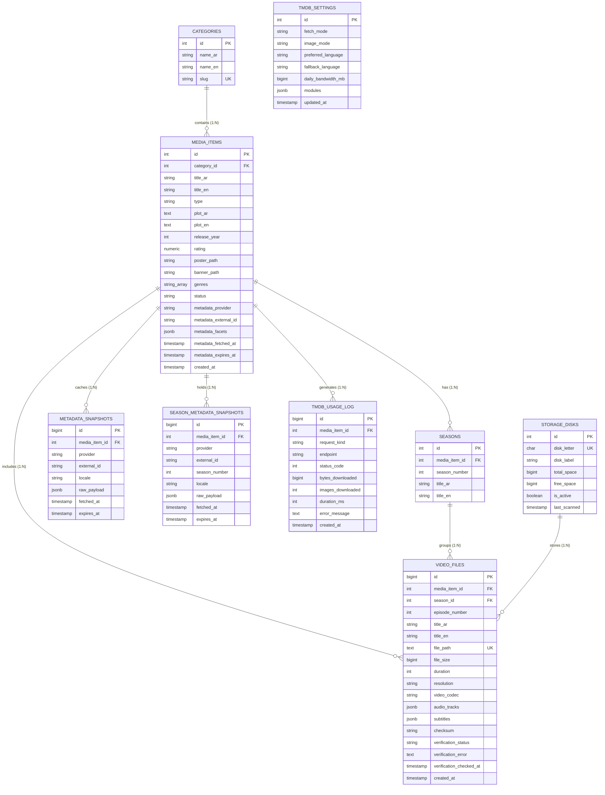
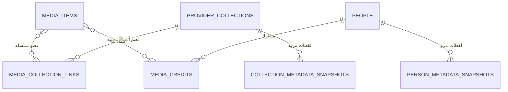

# 🗄️ وثيقة المواصفات الهندسية الشاملة لقاعدة بيانات نظام NEXORA
> **الدليل المعماري المرجعي لقاعدة البيانات (PostgreSQL 16 Engine)** | نظام NEXORA (LAN-First)

---

## 1. الفكرة العامة والتصميم المعماري (Database Architecture Overview)

صُممت قاعدة بيانات نظام **NEXORA** بالاعتماد على محرك **PostgreSQL 16 Relational Engine** لتقديم أداء استثنائي في إدارة مكتبات وسائط ضخمة تتجاوز 100 تيرابايت، وتحقيق الأهداف التالية:

1. **الفصل التام بين الملكية الفيزيائية والبيانات الوصفية**:
   - بيانات الملف الفيزيائي (المسار، الحجم، الجودة، مسارات الصوت والترجمات، بصمة SHA-256، وحالة الفحص) تُدار حصراً عبر جداول `video_files` و`storage_disks`.
   - البيانات الوصفية والإثرائية من TMDB/MAL تُخزن في جداول منفصلة مثل `metadata_snapshots` و`season_metadata_snapshots` مع عمر كاش محدد (TTL)، مما يضمن عدم تلف أو مسح بيانات الملفات المحلية أثناء تحديث البيانات الوصفية.
2. **فهرسة متعددة المستويات واستعلامات تحت الـ 5ms**:
   - استخدام فهارس مركبة (Compound Unique Indexes) لمنع التكرار أثناء مسح الأقراص المتوازي.
   - استخدام فهارس `GIN` (Generalized Inverted Index) على أعمدة `JSONB` للبحث اللحظي المتقدم في خصائص وفلاتر TMDB (`metadata_facets`).
3. **تكامل فوري مع محرك البحث Meilisearch**:
   - مزامنة البيانات الأساسية بسلاسة لتقديم بحث عربي/إنجليزي تسامحي (Typo-Tolerant) للعملاء.

---

## 2. مخطط علاقات الكيانات (Entity Relationship Diagram - ERD)



---

## 3. تفاصيل الجداول والأعمدة والفهارس (Detailed Schema Specifications)

### 3.0 امتداد شبكة الكتالوج المحلي: السلاسل والأشخاص

أضافت migration `0011_add_provider_collections_people.sql` شبكة مستقلة عن `collections` التحريرية. `collections` يبقى للتجميعات التي يصممها مدير NEXORA، أما `provider_collections` فيحتفظ بسلاسل TMDB الثابتة عبر `provider + external_id`؛ لذلك لا يعتمد النظام إطلاقاً على الاسم العربي أو الإنجليزي في الربط.



| الجدول | الهوية/القيود الأساسية | غرضه |
|---|---|---|
| `provider_collections` | `UNIQUE(provider, external_id)` و`slug` فريد | سلسلة أفلام مزودة محلياً مع النصين، الصور، وعدد الأجزاء المحلية |
| `media_collection_links` | `PRIMARY KEY(media_item_id, collection_id)` | عضوية العمل في سلسلة؛ لا تلمس الملف الفيزيائي |
| `collection_metadata_snapshots` | لقطة خام لكل لغة | حفظ تفاصيل السلسلة الكاملة عند تفعيل تحديثها |
| `people` | `UNIQUE(provider, external_id)` و`slug` فريد | ممثل أو مخرج أو مشارك حقيقي، لا شخصية خيالية نصية |
| `media_credits` | فهارس فريدة جزئية لـ`provider_credit_id` | الدور واسم الشخصية والـbilling مرتبطة بالعمل، لا بالشخص وحده |
| `person_metadata_snapshots` | لقطة خام لكل لغة | تفاصيل الشخص الاختيارية، بعيداً عن جدول العرض السريع |

**سياسة الحذف:** حذف `media_items` يحذف روابطه فقط بـ`ON DELETE CASCADE`. لا يحذف سلسلة أو شخصاً لأنهما قد يرتبطان بأعمال أخرى، ويمكن تنظيف الكيانات اليتيمة بمهمة صيانة مستقلة لاحقاً.

**سياسة الشبكة:** `GET /api/franchises` و`GET /api/people` وصفحاتهما لا تستخدم الإنترنت. الشبكة مسموحة فقط أثناء إثراء/تحديث إداري، وبعدها تحفظ البيانات في PostgreSQL ومسار صور محلي عند تفعيل التخزين المحلي.

### 3.1 جدول الأقسام الرئيسية (`categories`)
يحدد الأقسام الستة الأساسية للنظام (أفلام، مسلسلات، أنمي، كرتون، مسرحيات، وثائقيات).

| الحقل | نوع البيانات | القيود | الوصف |
| :--- | :--- | :--- | :--- |
| `id` | `SERIAL` | `PRIMARY KEY` | المعرف الفريد للقسم |
| `name_ar` | `VARCHAR(100)` | `NOT NULL` | الاسم المعرب للقسم (مثال: "مسلسلات") |
| `name_en` | `VARCHAR(100)` | `NOT NULL` | الاسم الإنجليزي (مثال: "Series") |
| `slug` | `VARCHAR(100)` | `UNIQUE, NOT NULL` | المعرف النصي الفريد للروابط والتصفية (movies, series, anime...) |

---

### 3.2 جدول الأعمال الفنية (`media_items`)
الجدول المركزي للأعمال السينمائية والتلفزيونية والأنمي.

| الحقل | نوع البيانات | القيود | الوصف |
| :--- | :--- | :--- | :--- |
| `id` | `SERIAL` | `PRIMARY KEY` | المعرف الفريد للعمل |
| `category_id` | `INT` | `REFERENCES categories(id)` | رابط القسم المرتبط |
| `title_ar` | `VARCHAR(255)` | `NULLABLE` | العنوان العربي الرسمي المعتمد |
| `title_en` | `VARCHAR(255)` | `NOT NULL` | العنوان الإنجليزي أو اللاتيني الأصلي |
| `type` | `VARCHAR(50)` | `NOT NULL` | نوع الوسيط: `movie`, `series`, `anime` |
| `plot_ar` | `TEXT` | `NULLABLE` | قصة وملخص العمل بالعربية |
| `plot_en` | `TEXT` | `NULLABLE` | قصة وملخص العمل بالإنجليزية |
| `release_year` | `INT` | `NULLABLE` | سنة الإصدار الفعلي |
| `rating` | `NUMERIC(3, 1)`| `NULLABLE` | التقييم الرقمي للعمل (من 0.0 إلى 10.0) |
| `poster_path` | `VARCHAR(500)` | `NULLABLE` | مسار صورة البوستر (محلي أو رابط CDN) |
| `banner_path` | `VARCHAR(500)` | `NULLABLE` | مسار صورة الخلفية العريضة |
| `genres` | `VARCHAR(255)[]`| `NULLABLE` | مصفوفة التصنيفات ووسوم الدول (أكشن، دراما، كوري...) |
| `status` | `VARCHAR(50)` | `DEFAULT 'completed'` | حالة العمل: `completed`, `ongoing` |
| `metadata_provider` | `VARCHAR(50)`| `NULLABLE` | مصدر البيانات: `tmdb`, `mal`, `local_catalog` |
| `metadata_external_id`| `VARCHAR(100)`| `NULLABLE` | معرف العمل في قاعدة البيانات الخارجية |
| `metadata_facets` | `JSONB` | `DEFAULT '{}'::jsonb`| مستخلص الخصائص المفهرسة السريعة (Runtime, Keywords, Countries) |
| `metadata_fetched_at` | `TIMESTAMP` | `NULLABLE` | تاريخ وتوقيت جلب البيانات الوصفية |
| `metadata_expires_at` | `TIMESTAMP` | `NULLABLE` | تاريخ انتهاء صلاحية الكاش لإعادة التحديث |
| `created_at` | `TIMESTAMP` | `DEFAULT CURRENT_TIMESTAMP`| توقيت إدخال العمل في المكتبة |

**الفهارس المطبقة (Indexes):**
- `CREATE UNIQUE INDEX idx_media_items_identity ON media_items(type, LOWER(title_en), COALESCE(release_year, 0));` لمنع تكرار الإدخال أثناء المسح التلقائي.
- `CREATE INDEX idx_media_items_category_id ON media_items(category_id);` لتسريع التصفية حسب الأقسام.
- `CREATE INDEX idx_media_items_type ON media_items(type);` لتسريع التصفية حسب نوع الوسيط.
- `CREATE INDEX idx_media_items_metadata_facets_gin ON media_items USING GIN (metadata_facets jsonb_path_ops);` للبحث والفلترة الفورية داخل بيانات JSONB.

---

### 3.3 جدول المواسم (`seasons`)
يربط المواسم التلفزيونية ومواسم الأنمي بالأعمال التابعة لها.

| الحقل | نوع البيانات | القيود | الوصف |
| :--- | :--- | :--- | :--- |
| `id` | `SERIAL` | `PRIMARY KEY` | المعرف الفريد للموسم |
| `media_item_id` | `INT` | `REFERENCES media_items(id) ON DELETE CASCADE` | معرف العمل التابع له |
| `season_number` | `INT` | `NOT NULL` | رقم الموسم (1, 2, 3...) |
| `title_ar` | `VARCHAR(150)` | `NULLABLE` | عنوان مخصص للموسم بالعربية |
| `title_en` | `VARCHAR(150)` | `NULLABLE` | عنوان الموسم بالإنجليزية |

**القيود الفريدة:** `UNIQUE(media_item_id, season_number)`

---

### 3.4 جدول ملفات الفيديو الفيزيائية (`video_files`)
يمثل كل ملف فيديو فيزيائي على الأقراص الصلبة (حلقة مسلسل، أو فيلم سينمائي).

| الحقل | نوع البيانات | القيود | الوصف |
| :--- | :--- | :--- | :--- |
| `id` | `BIGSERIAL` | `PRIMARY KEY` | المعرف الفريد لملف الفيديو |
| `media_item_id` | `INT` | `REFERENCES media_items(id) ON DELETE CASCADE` | العمل التابع له الملف |
| `season_id` | `INT` | `REFERENCES seasons(id) ON DELETE CASCADE` | الموسم (NULL للأفلام المستقلة) |
| `episode_number` | `INT` | `NULLABLE` | رقم الحلقة داخل الموسم (NULL للأفلام) |
| `title_ar` | `VARCHAR(255)` | `NULLABLE` | اسم الحلقة بالعربية |
| `title_en` | `VARCHAR(255)` | `NULLABLE` | اسم الحلقة أو الملف بالإنجليزية |
| `file_path` | `TEXT` | `UNIQUE, NOT NULL` | المسار الفيزيائي المطلق للملف بالسيرفر (`D:\Media\...`) |
| `file_size` | `BIGINT` | `NOT NULL` | حجم الملف بالبايت |
| `duration` | `INT` | `NULLABLE` | مدة الفيديو بالثواني (مستخرجة عبر FFprobe) |
| `resolution` | `VARCHAR(50)` | `NULLABLE` | دقة العرض (4K, 1080p, 720p) |
| `video_codec` | `VARCHAR(50)` | `NULLABLE` | كودك ضغط الفيديو (h264, hevc/h265, av1) |
| `audio_tracks` | `JSONB` | `DEFAULT '[]'::jsonb` | قائمة مسارات الصوت واللغات المتاحة بالملف |
| `subtitles` | `JSONB` | `DEFAULT '[]'::jsonb` | قائمة الترجمات المدمجة والخارجية |
| `checksum` | `VARCHAR(64)` | `NULLABLE` | بصمة SHA-256 للتحقق من سلامة الملف والتكرار |
| `verification_status`| `VARCHAR(20)`| `DEFAULT 'unverified'`| حالة الفحص الفني: `healthy`, `corrupted`, `unverified` |
| `verification_error` | `TEXT` | `NULLABLE` | سجل أخطاء FFmpeg في حال كان الملف تالفاً |
| `verification_checked_at`| `TIMESTAMP`| `NULLABLE` | تاريخ وتوقيت آخر فحص فك تشفير |
| `created_at` | `TIMESTAMP` | `DEFAULT CURRENT_TIMESTAMP`| توقيت فهرسة الملف |

**الفهارس المطبقة (Indexes):**
- `CREATE UNIQUE INDEX idx_video_files_file_path ON video_files(file_path);`
- `CREATE INDEX idx_video_files_media_item_id ON video_files(media_item_id);`
- `CREATE INDEX idx_video_files_season_id ON video_files(season_id);`
- `CREATE INDEX idx_video_files_episode_number ON video_files(episode_number);`
- `CREATE INDEX idx_video_files_checksum ON video_files(checksum) WHERE checksum IS NOT NULL;`

---

### 3.5 جدول الأقراص التخزينية المراقبة (`storage_disks`)
يراقب الأقراص الصلبة المرتبطة بالسيرفر واستهلاك المساحات.

| الحقل | نوع البيانات | القيود | الوصف |
| :--- | :--- | :--- | :--- |
| `id` | `SERIAL` | `PRIMARY KEY` | المعرف الفريد للقرص |
| `disk_letter` | `CHAR(1)` | `UNIQUE, NOT NULL` | حرف القرص في ويندوز (D, E, F, G...) |
| `disk_label` | `VARCHAR(100)` | `NULLABLE` | تسمية القرص (Volume Label) |
| `total_space` | `BIGINT` | `NOT NULL` | إجمالي سعة القرص بالبايت |
| `free_space` | `BIGINT` | `NOT NULL` | المساحة المتبقية الفارغة بالبايت |
| `is_active` | `BOOLEAN` | `DEFAULT TRUE` | هل القرص متصل ونشط |
| `last_scanned` | `TIMESTAMP` | `NULLABLE` | تاريخ آخر فحص للأقراص |

---

### 3.6 جدول إعدادات TMDB (`tmdb_settings`)
جدول أحادي (Singleton Row ID=1) لحفظ إعدادات لوحة تحكم TMDB واستراتيجيات التخزين.

| الحقل | نوع البيانات | القيود | الوصف |
| :--- | :--- | :--- | :--- |
| `id` | `INT` | `PRIMARY KEY, CHECK (id = 1)` | القيد الأحادي للجدول |
| `fetch_mode` | `VARCHAR(30)` | `DEFAULT 'standard'` | وضع الجلب: `essential`, `standard`, `full`, `custom` |
| `image_mode` | `VARCHAR(30)` | `DEFAULT 'hybrid'` | وضع الصور: `hybrid`, `local`, `remote` |
| `preferred_language` | `VARCHAR(20)` | `DEFAULT 'ar-SA'` | اللغة الأساسية المفضلة لطلب البيانات |
| `fallback_language` | `VARCHAR(20)` | `DEFAULT 'en-US'` | لغة الاحتياط عند غياب الترجمة العربية |
| `include_image_language`| `VARCHAR(50)`| `DEFAULT 'ar,en,null'`| لغات الصور المطلوبة بترتيب الأولوية |
| `daily_bandwidth_mb` | `BIGINT` | `DEFAULT 500` | حد الاستهلاك اليومي للإنترنت بالميجابايت |
| `enable_rate_limit_delay`| `BOOLEAN` | `DEFAULT TRUE` | تفعيل التراجع الذكي لتفادي حظر 429 |
| `poster_size` | `VARCHAR(20)` | `DEFAULT 'w500'` | دقة صورة البوستر الافتراضية |
| `backdrop_size` | `VARCHAR(20)` | `DEFAULT 'original'` | دقة الخلفية العريضة |
| `modules` | `JSONB` | `DEFAULT '{}'::jsonb` | كائن JSON يحتوي على حالات كافة المفاتيح التفصيلية (Toggles) |
| `remote_config` | `JSONB` | `DEFAULT '{}'::jsonb` | كاش الأحجام المتاحة المسترجعة من TMDB `/configuration` |
| `updated_at` | `TIMESTAMP` | `DEFAULT CURRENT_TIMESTAMP`| تاريخ آخر تعديل للإعدادات |

---

### 3.7 جداول النسخ الاحتياطية الوصفية (`metadata_snapshots` & `season_metadata_snapshots`)
تحتفظ بالاستجابة الكاملة من مزود TMDB للغات المتعددة دون تضخيم جدول `media_items`.

- **`metadata_snapshots`**: يربط العمل الفني بالنسخة الخام للغة معينة (`ar-SA` أو `en-US`).
- **`season_metadata_snapshots`**: يربط مواسم المسلسلات والأنمي ببيانات الحلقات والمدد والـ Stills الخاصة بها لكل لغة.

**فهارس انتهاء الصلاحية والكاش:**
- `CREATE INDEX idx_metadata_snapshots_expiry ON metadata_snapshots(expires_at);`
- `CREATE INDEX idx_season_metadata_snapshots_lookup ON season_metadata_snapshots(media_item_id, season_number, locale);`

---

### 3.8 جدول سجلات الاستهلاك ومراقبة الباندويث (`tmdb_usage_log`)
يسجل كل طلب API يتم إجراؤه مع حجم البيانات المنزلة وزمن الاستجابة لمراقبة الكوتا اليومية.

| الحقل | نوع البيانات | الوصف |
| :--- | :--- | :--- |
| `id` | `BIGSERIAL PK` | معرف السجل |
| `media_item_id` | `INT FK` | معرف العمل المرتبط (إن وجد) |
| `request_kind` | `VARCHAR(50)` | نوع الطلب: `search`, `details`, `season`, `image`, `test_connection` |
| `endpoint` | `VARCHAR(300)` | نقطة الاتصال المستهدفة |
| `status_code` | `INT` | رمز استجابة HTTP (200, 429, 502...) |
| `bytes_downloaded`| `BIGINT` | عدد البايتات المحملة عبر الشبكة |
| `images_downloaded`| `INT` | عدد الصور التي تم تنزيلها بهذا الطلب |
| `duration_ms` | `INT` | زمن استجابة الطلب بالمللي ثانية |
| `error_message` | `TEXT` | تفاصيل الخطأ إن وجد |
| `created_at` | `TIMESTAMP` | توقيت تنفيذ الطلب |

---

## 4. استعلامات الأداء والصيانة الشائعة (Performance & Maintenance Queries)

### كشف الحلقات المفقودة في المسلسلات والأنمي
```sql
WITH numbered AS (
    SELECT season_id, MAX(episode_number) AS max_episode
    FROM video_files WHERE season_id IS NOT NULL AND episode_number IS NOT NULL
    GROUP BY season_id
)
SELECT s.media_item_id, s.id AS season_id, s.season_number, expected.episode_number AS missing_episode
FROM seasons s
JOIN numbered n ON n.season_id = s.id
CROSS JOIN LATERAL generate_series(1, n.max_episode) AS expected(episode_number)
LEFT JOIN video_files vf ON vf.season_id = s.id AND vf.episode_number = expected.episode_number
WHERE vf.id IS NULL
ORDER BY s.media_item_id, s.season_number, expected.episode_number;
```

### كشف الملفات المكررة بناءً على البصمة المشتركة (SHA-256)
```sql
SELECT checksum, file_size, COUNT(*) AS duplicate_count, array_agg(file_path) AS paths
FROM video_files
WHERE checksum IS NOT NULL AND checksum <> ''
GROUP BY checksum, file_size
HAVING COUNT(*) > 1;
```

### تقرير استهلاك الإنترنت اليومي من TMDB
```sql
SELECT 
    COUNT(*) AS total_requests_today,
    ROUND(SUM(bytes_downloaded) / (1024.0 * 1024.0), 2) AS total_mb_today,
    SUM(images_downloaded) AS images_cached_today
FROM tmdb_usage_log
WHERE created_at >= CURRENT_DATE;
```
