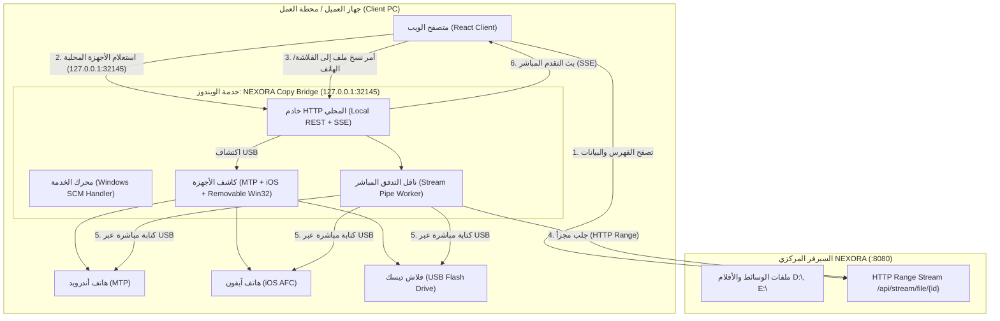

# خطة معمارية وتنفيذية: خدمة NEXORA Copy Bridge (Windows Service) لعزل وإدارة نسخ USB

> **حالة التنفيذ (2026-09-17):** نُفّذت الخطة (المراحل 1-4 + الخطوات 1-6) والقرار موثّق في [ADR-008](docs/decisions/ADR-008-local-copy-bridge-usb-transfer.md). الأقسام أدناه تبقى كمرجع للتصميم الأصلي. المؤجل بقرار المالك: token اختياري للأوامر الحساسة، وTray Agent. للتفاصيل الفعلية راجع [تقرير الحالة](docs/copy/BRIDGE_STATUS_AND_REMAINING_PLAN.md).

## 1. ملخص المشكلة والوضع الراهن (Executive Summary & Problem Statement)

### المشكلة الحالية
في المعمارية الحالية لنظام NEXORA:
- يقوم السيرفر المركزي (`server/internal/app/app.go` و `server/internal/api/handlers_transfer.go`) بتشغيل خدمة فحص أجهزة الـ USB محلياً على جهاز السيرفر نفسه عبر `transfer.NewService`.
- عندما يفتح أي عميل أو صالة ألعاب المتصفح ويتصفح NEXORA، ترسل واجهة React طلبات فحص الأجهزة إلى السيرفر المركزي (`http://<server-ip>:8080/api/transfer/devices`).
- **النتيجة الكارثية:** 
  1. جميع الأجهزة والهواتف والفلاشات الموصولة في جهاز السيرفر الرئيسي تُعرض لجميع الأجهزة والزبائن في الشبكة (تسريب بيانات وانتهاك خصوصية).
  2. الأجهزة الموصولة بجهاز العميل المحلي (Workstation/Client PC) لا تظهر للعميل في المتصفح لأن السيرفر المركزي لا يراها ولا يعلم بوجودها!
  3. مشاركة طوابير النسخ (Transfer Jobs) بين جميع المستخدمين، فإذا نسخ مستخدم في غرفة رقم 1 ملفاً، يظهر تقدم النسخ لجميع الأجهزة الأخرى.

### الحل الجذري المطلوب
بناء برنامج وسيط خفيف وعالي الأداء **NEXORA Copy Bridge** يعمل كخدمة ويندوز تلقائية في الخلفية (**Windows Service**) بصلاحيات مسؤول (Administrator) على كل جهاز محلي/كلاينت:
1. يستمع فقط محلياً على عنوان الحلقة المغلقة `127.0.0.1:32145` (Localhost-Only).
2. واجهة الويب على متصفح العميل تتصل بـ `127.0.0.1:32145` بدلاً من السيرفر المركزي لأي عملية تخص أجهزة الـ USB.
3. كل جهاز عميل يرى **فقط وحصرياً** هواتفه وفلاشاته الموصولة فيه هو.
4. تتم عملية النقل بجلب أجزاء الفيديو من السيرفر المركزي (عبر HTTP Range Stream) وكتابتها مباشرة إلى وحدة تخزين الهاتف/الفلاشة المحلية بسرعة الـ LAN والـ USB القصوى.

---

## 2. تحليل الميزات الحالية في نظام النسخ بالتفصيل (Current Copy System Features)

يحتوي نظام NEXORA الحالي في مسارات `server/internal/transfer` و `server/internal/copybridge` وواجهة الويب على بنية تحتية ثرية جداً، سيتم الحفاظ عليها بالكامل ونقلها للخدمة الجديدة:

### أ. دعم مختلف منصات الأجهزة (Cross-Platform USB Device Support)
1. **أجهزة الأندرويد (Android MTP - Media Transfer Protocol):**
   - فحص واكتشاف أجهزة الأندرويد الموصولة عبر كائن ويندوز `Shell.Application` ومساحة أسماء محركات الأقراص (SSF 17).
   - قراءة مساحات التخزين (Internal Shared Storage، كروت الذاكرة الخارجية SD Card).
   - استعراض الشجرة والمجلدات داخل الأندرويد وإنشاء المجلدات (`Mkdir`).
   - تنفيذ النسخ التلقائي بصمت عبر خيار `CopyHere(16)` لتجاوز نوافذ الويندوز المنبثقة.
   - مراقبة حجم الملف المتزايد على الأندرويد لاحتساب نسبة التقدم والسرعة.
2. **أجهزة آبل (Apple iOS - iPhone / iPad):**
   - اتصال USB مباشر عالي السرعة عبر بروتوكول `usbmuxd` ومكتبة `github.com/danielpaulus/go-ios`.
   - استخدام بروتوكول `AFC` (Apple File Conduit) وخدمة `House Arrest` للكتابة داخل مجلدات التطبيقات دون الحاجة لـ iTunes.
   - اكتشاف التطبيقات التي تدعم مشاركة الملفات (`UIFileSharingEnabled`) مثل VLC و Documents by Readdle و PlayerXtreme وغيرها.
   - فحص المجلدات الداخلية لمستندات التطبيق وإنشاء مجلدات مخصصة.
   - استعراض التطبيقات المثبتة تلقائياً أو إدخال Bundle ID مخصص.
3. **وسائط التخزين القابلة للإزالة (Removable USB Drives / Flash Disks):**
   - اكتشاف لحظي فائق السرعة (<1ms بدون أي استهلاك للمعالج) باستخدام Windows Win32 API المباشر (`kernel32.dll`: `GetLogicalDrives`, `GetDriveTypeW`, `GetDiskFreeSpaceExW`, `GetVolumeInformationW`).
   - حصر الفحص في وحدات التخزين القابلة للإزالة من النوع `DRIVE_REMOVABLE` فقط وتجاهل الأقراص الداخلية الثابتة (C, D, ...).
   - حساب السعة الكلية والمساحة المتبقية واسم القرص تلقائياً.
   - دعم خاصية الإخراج الآمن للفلاشة (`Safe Eject`).

### ب. محرك النقل والجدولة (Transfer Engine & Operations)
1. **إدارة المهام والجدولة (Job Queue & Concurrency):**
   - جدولة مهام النقل بحساب لكل جهاز لمنع تضارب الـ I/O على منفذ الـ USB الواحد.
   - دعم النسخ الفردي أو النسخ المتعدد بالدفعة (Batch Transfer) لعدة ملفات أو مواسم كاملة.
2. **القياسات الحية والتقدم (Live Metrics & Progress):**
   - حساب دقيق لحجم البيانات المنقولة والإجمالي بالبايت.
   - حساب السرعة اللحظية بوحدة MB/s و Bps.
   - حساب الوقت التقديري المتبقي (ETA Seconds).
   - متابعة مراحل العمل: `queued` → `preparing` → `downloading` (من السيرفر) → `copying` (إلى الجهاز) → `verifying` → `completed`.
3. **التحقق وسلامة البيانات (Data Integrity Verification):**
   - التحقق السريع من تطابق حجم الملف المكتوب (`VerifySize`).
   - دعم التحقق الدقيق ببصمة التشفير الكاملة (`VerifyStrict` عبر SHA-256).
4. **التراجع والإلغاء الآمن (Cancellation & Cleanup):**
   - إلغاء فوري ونظيف لأي مهمة قيد التشغيل عبر `context.WithCancel`.
   - تنظيف تلقائي للملفات المؤقتة والملفات غير المكتملة (`.part`).
5. **البث المباشر للأحداث (Server-Sent Events - SSE):**
   - قناة SSE عند الرابط `/api/transfer/events` تبث فورياً أحداث توصيل/فصل الأجهزة (Hotplug) وتحديثات تقدم النقل لجميع شاشات العميل دون استهلاك موارد الشبكة بـ HTTP Polling.

### ج. واجهة المستخدم وتجربة الاستخدام (UI/UX)
1. نافذة النسخ للهواتف `CopyToPhoneModal.jsx`: لاختيار نوع الجهاز، والتطبيق، والمجلد المستهدف.
2. إدارة حالة النقل المركزية `TransferContext.jsx`: لمتابعة الملفات المحددة والمهام النشطة.
3. شريط النقل المصغر (Mini Transfer Center): نافذة عائمة تظهر تقدم النقل وسرعته وخيار الإلغاء.
4. صفحة الإدارة `AdminTransferPage.jsx`: لمراقبة الأجهزة المتصلة وحالة الذاكرة.

---

## 3. الأدوات والمكتبات والأكواد الحالية التي سيتم إعادة استخدامها (Reusable Tools & Libraries)

لحفظ وقت التطوير وضمان التوافق التام، لن نبدأ من الصفر، بل سنستغل كنوز الكود الموجودة في المشروع:

| المكون / المكتبة | المصدر الحالي في المشروع | الغرض ودورها في خدمة الـ Bridge الجديدة |
|---|---|---|
| **`golang.org/x/sys/windows/svc`** | مثبتة بالفعل في `server/go.mod` | إدارة دورة حياة خدمة الويندوز بالكامل (بدء الخدمة، إيقافها، والتفاعل مع Windows Service Control Manager - SCM). |
| **`kernel32.dll` (Win32 API)** | `server/internal/transfer/removable_windows.go` | اكتشاف الفلاشات وأقراص الـ USB القابلة للإزالة في أجزاء من الميلي ثانية وبدون حمل على المعالج. |
| **`github.com/danielpaulus/go-ios`** | مثبتة في `server/go.mod` ومستخدمة في `go_ios_backend.go` | اكتشاف هواتف iPhone وأجهزة iPad عبر كابل الـ USB ونقل الملفات مباشرة إلى مستندات التطبيقات. |
| **محرك نقل الأندرويد MTP** | `server/internal/transfer/android_backend.go` | الاتصال بأجهزة الأندرويد وإنشاء المجلدات والنسخ المباشر عبر Shell COM. |
| **محرك الـ Storage Backend** | `server/internal/transfer/storage_backend.go` | النسخ فائق السرعة عبر Buffered I/O (4MB buffer) للفلاشات. |
| **نظام التقدم والأحداث** | `server/internal/transfer/progress.go` و `events.go` | حساب السرعة والـ ETA وإرسال أحداث SSE للواجهة. |
| **واجهات React الحالية** | `CopyToPhoneModal.jsx` و `TransferContext.jsx` و `AdminTransferPage.jsx` | تبقى كما هي بنسبة 95%، وتوجه طلباتها فقط إلى `127.0.0.1:32145` عند فتح نافذة النقل. |

---

## 4. تحليل المشاكل البرمجية والتكرار في الكود الحالي (Code Review & Anti-Patterns)

خلال فحص الكود الحالي، تم رصد التكرار وعدم الترتيب التالي:
1. **تكرار Endpoints كاملة:** تم تكرار الـ 10 endpoints الخاصة بالنقل مرتين: الأولى داخل السيرفر الرئيسي `server/internal/api/handlers_transfer.go`، والثانية داخل `server/internal/copybridge/server.go`.
2. **تكرار منطق النقل:** يوجد كود نقل قديم ومطوّل في `server/internal/transfer/service.go` (1591 سطر) مع كود v2 جديد في `engine.go` و `android_backend.go`.
3. **توليد عشوائي لنصوص PowerShell:** نصوص PowerShell مكررة ومكتوبة كـ strings طويلة مدمجة في عدة أماكن يصعب تتبعها واختبارها.
4. **عدم دعم Windows Service رسمي:** ملف `server/cmd/copybridge/main.go` كُتب كبرنامج Console عادي، مما يجعله يفشل إذا تم تشغيله مباشرة عبر `sc.exe` بدون ربطه بواجهة `svc.Handler`.
5. **الاعتماد على التنزيل الكامل ثم النسخ:** في `copybridge/service.go` يتم تنزيل الملف كاملاً أولاً في مجلد Temp ثم نسخه للهاتف، مما يضاعف وقت النقل ويستهلك مساحة القرص المحلي C! بينما الأصح هو البث التدريجي المتوازي (Streaming Pipe) من السيرفر إلى الجهاز مباشرة.

---

## 5. المعمارية المقترحة لخدمة NEXORA Copy Bridge (Proposed Architecture)



### مزايا المعمارية المقترحة:
1. **عزل كامل للبيانات والأجهزة:** جهاز العميل رقم 5 لن يرى إلا أجهزته الموصولة في جهازه رقم 5.
2. **استقلالية السيرفر المركزي:** السيرفر لا يشغل أي عمليات فحص لأجهزة USB ولا يدير أي Shell COM، فقط يقدم الملفات عبر HTTP Range.
3. **أداء مضاعف بدون استهلاك قرص C:** استخدام Streaming Pipe ينقل البيانات من شبكة الـ LAN إلى الـ USB مباشرة بـ RAM Buffer محدد (4MB) دون تخزين مؤقت على القرص.
4. **يعمل في الخلفية تلقائياً:** يتم تثبيت الخدمة بنقرة واحدة عبر `sc.exe` أو سكريبت مدمج، لتبدأ مع إقلاع الويندوز بصلاحيات النظام التامة.

---

## 6. خطة التنفيذ خطوة بخطوة (Step-by-Step Implementation Plan)

### المرحلة 1: بناء ثنائي خدمة الويندوز النظيف (`server/cmd/copybridge`)
1. دعم بروتوكول `golang.org/x/sys/windows/svc`:
   - جعل البرنامج يفحص إذا كان يعمل كـ Windows Service بواسطة SCM أو كتطبيق Console تفاعلي للمطور (`-debug`).
   - دعم أوامر التثبيت والإزالة المدمجة:
     - `nexora-bridge.exe -install`
     - `nexora-bridge.exe -uninstall`
     - `nexora-bridge.exe -start`
     - `nexora-bridge.exe -stop`
2. توفير سكريبت تثبيت سريع بالأداة الأصلية `sc.exe`:
   ```bat
   @echo off
   :: install-bridge-service.bat
   sc.exe create NEXORACopyBridge binPath= "%~dp0nexora-bridge.exe -service" start= auto DisplayName= "NEXORA USB Copy Bridge"
   sc.exe description NEXORACopyBridge "خدمة NEXORA لنقل الوسائط والأفلام إلى أجهزة USB والهواتف المحلية"
   sc.exe start NEXORACopyBridge
   netsh advfirewall firewall add rule name="NEXORA Copy Bridge" dir=in action=allow protocol=TCP localport=32145
   ```

### المرحلة 2: تنظيف وإعادة هيكلة كود النقل (`server/internal/transfer` & `copybridge`)
1. **توحيد المحرك:** اعتماد `TransferEngine` و `TransferBackend` كمعمارية وحيدة ونظيفة، وإزالة التكرار القديم في `service.go`.
2. **تحسين أداء النقل (Zero-Spool Direct Stream):**
   - عندما يطلب العميل نسخ ملف برابط `source_url` (من السيرفر المركزي)، لا يتم حفظه كاملاً على قرص الـ SSD/C.
   - يقوم الـ Bridge بفتح اتصال HTTP Range مع السيرفر وتمرير الـ `io.Reader` مباشرة إلى منفذ الـ USB بمخزن مؤقت 4MB.
3. **تأمين CORS والاتصال المحلي:**
   - ضبط خادم الـ Bridge ليقبل الطلبات القادمة من متصفح العميل (CORS headers مع السماح بـ `http://localhost:*` و عناوين الـ LAN الخاصة بالسيرفر).

### المرحلة 3: تنظيف السيرفر المركزي (`server/internal/api` & `app.go`)
1. إزالة كود فحص الـ USB من السيرفر المركزي `app.Run`:
   - السيرفر لم يعد بحاجة لتشغيل `transfer.NewService` الذي كان يفحص أقراص وهواتف السيرفر.
2. تحويل نقاط `/api/transfer/...` في السيرفر لتكون اختيارية أو إعادة توجيهها أو إلغائها لمنع أي تسريب لأجهزة السيرفر.

### المرحلة 4: ربط واجهة المتصفح (React Frontend)
1. تعديل `client/src/lib/api.js`:
   - تعريف عنوان الـ Bridge المحلي: `const BRIDGE_BASE_URL = "http://127.0.0.1:32145";`
   - توجيه دوال `getTransferDevices`, `getTransferDeviceApps`, `startDeviceTransfer`, `getTransferJobs`, `ejectTransferDevice` للاتصال بـ `BRIDGE_BASE_URL`.
2. في حال كان الـ Bridge غير مشغّل على جهاز العميل:
   - عرض تنبيه لطيف واحترافي داخل `CopyToPhoneModal.jsx`: *"يرجى التأكد من تشغيل خدمة NEXORA Copy Bridge على هذا الجهاز لتمكين النسخ إلى USB والهواتف"*.

---

## 7. ملاحظات فنية هامة بخصوص خدمات الويندوز (Technical Notes & Caveats)

> [!IMPORTANT]
> **ملاحظة عزل Session 0 في خدمات الويندوز (Session 0 Isolation):**
> خدمات الويندوز التي تعمل تحت حساب `LocalSystem` تعمل في الـ Session 0 المعزولة بدون واجهة مستخدم أو سطح مكتب.
> - أجهزة آبل (iOS عبر usbmuxd) والفلاشات (Win32 kernel32) تعمل بكفاءة 100% في Session 0 وتحت أي حساب.
> - أجهزة الأندرويد المعتمدة على `Shell.Application` COM قد تتطلب سياق مستخدم تفاعلي في بعض إصدارات ويندوز الحديثة.
> - **الحل الهندسي المعتمد في خطتنا:** 
>   1. إتاحة تشغيل الخدمة تحت حساب المستخدم الحالي أو Administrator عبر `sc.exe config NEXORACopyBridge obj= ".\Administrator" password= "..."`.
>   2. إضافة خيار تشغيل كـ Background Tray Agent في مجلد `shell:startup` كبديل مرن للصالات التي تفضل عدم تشغيل خدمات نظام عميقة.

---

## 8. خطة التحقق والاختبار (Verification Plan)

### الاختبارات البرمجية والتحقق الآلي
1. اختبار بناء وتشغيل الـ binary:
   ```pwsh
   cd server
   go build -o nexora-bridge.exe ./cmd/copybridge
   ```
2. اختبار سلامة واجهات الـ Backend:
   ```pwsh
   go test -v ./internal/transfer/...
   ```

### التحقق التشغيلي اليدوي
1. تشغيل السيرفر المركزي على جهاز، وفتح الواجهة من جهاز آخر في الشبكة.
2. التحقق من أن قائمة الأجهزة في واجهة المتصفح فارغة طالما لم يوصل العميل فلاشة أو هاتف في جهازه هو.
3. توصيل فلاشة USB أو هاتف أندرويد/آيفون في جهاز العميل، والتأكد من ظهورها فورياً عبر الـ Bridge المحلي دون أن تظهر لأي جهاز آخر في الشبكة.
4. بدء نسخ فيلم بحجم 2GB ومراقبة سرعة النقل وشريط التقدم المباشر (SSE) حتى اكتمال النقل بنجاح.
